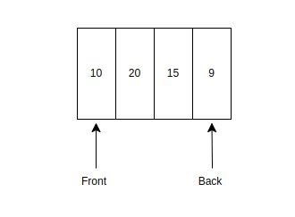
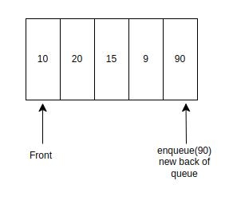
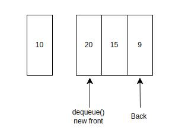
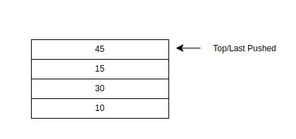
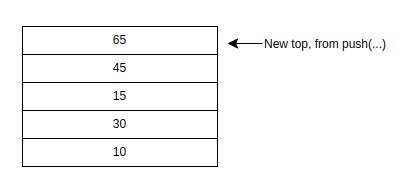
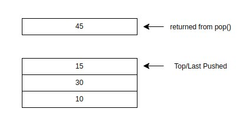

# List-Based Data Structures

While `Array` within JS isn't exactly what we call an array as it is similar to a `List` data structure. Usually arrays are fixed length while an array within JS is able to resize.

However, it does demonstrate the similarities and the relationship between an Array and a List. List-Based data structures are focused on representing their elements as a sequence. These data structures are also the foundation to other data structures like Maps and Sets.

The common list-based data structures that are explored and used are.

* Dynamic Array (`Array` type in javascript)
* Linked List
* Queue
* Stack

There are more niche kinds which have benefits or are a variation of an existing one such as.

* Unrolled Linked List
* Circular Queue (or Circular Buffer)

## Linked List

A linked list is a linked data structure. The typical structure requires the container type to hold onto the first node that will then hold onto the next and so on.

The container type is normally referred to as the `LinkedList` while the node is self explained and is outlined as `Node`. Each `Node` contains the data and a link to the next node.

Let's mockup/diagram how a linked list works.

```
1. Initialised Linked List, no data


LL.Root is null

Null (no elements)
````


```
2. We append the number 10


10 -> Null

One element has been added, Root is currently set to contain:
    * the number 10
    * a reference to the next link but is Null.

```
```
3. We append the number 20

10 -> 20 -> Null

Two elements are contained within the linked list
    * When appending, we started by checking to see if Root
        was Null, since it wasn't we proceeded to do:
    * Check the Next field of Root and see if it was Null
        It was, so we updated Root.Next to contain:
        * the number 20
        * a reference to the next link but is Null

    Note: Ideally, we wouldn't set Root.Next directly
        but use a variable called `cursor`
```
```
4. We append the number 30

10 -> 20 -> 30 -> Null

Two elements are contained within the linked list
    * When appending, we started by checking to see if Root
        was Null, since it wasn't we proceeded to do:
    * Check the Next field of Root and see if it was Null,
        since it wasn't we proceeded to do:
    * Check the Next field of Root.Next and see if it was Null
        It was, so we updated cursor.Next to contain:
        * the number 30
        * a reference to the next link but is Null

    Hopefully at this point, it is clear we need to use a
    loop and

```

A linked-list has the following methods, this is similar to a dynamic array that you are familiar with.

* `add(item)` - Adds to the end of the linked list

* `prepend(item)` - Adds to the start of the linked list

* `get(index)` - Uses the index to retrieve an element

* `remove(index)` - If the index is within bounds of 0...n, where n is the number of elements within the list. It will remove the element from the list.

## Queue

"Have you ever linked up at a bank or for food?"

The quote above does some lifting in providing a real-life scenario where one may have interacted with a queue. Within code, the analogy works as well but we need to isolate the structures involved.

A Queue is a kind of FIFO data structure, the first elements put into the queue are the first one to be removed.

<div style="text-align: center;">



</div>

Given that a queue is a FIFO data structure, we can view the data as kind of line-up. Where we see one come after the other.

We have a `front` and `back` of a queue. `.enqueue(...)` will result in an element placed at the back.  
<div style="text-align: center;">


</div>

A `dequeue(...)` will result in an element being removed from the front.

<div style="text-align: center;">



</div>

## Stack

We now have a LIFO data structure a `stack`. An analogy would be to consider a set of coasters sitting on top of each other. You would only take the top one, leaving the one below as the new top.

<div style="text-align: center;">



</div>


When `push`ing onto the stack, the element wil be the new top element.

<div style="text-align: center;">



</div>

When `pop`ing an element off the stack, it will reveal a new top element.


<div style="text-align: center;">



</div>
